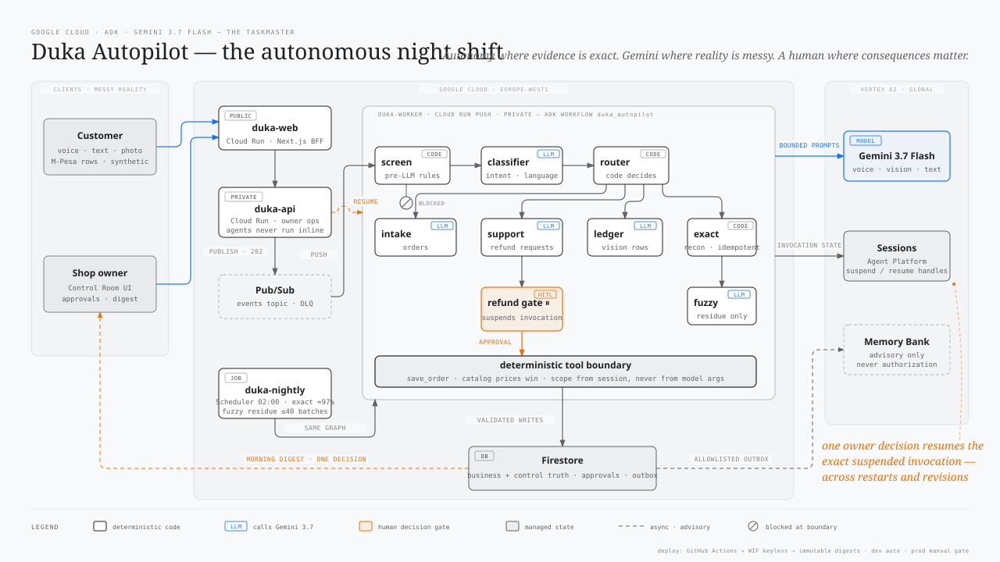

# Duka Autopilot

Duka means *Shop* in Swahili.

Across Africa, neighbourhood dukas are the heartbeat of daily commerce. But running one is an exhausting, multimodal balancing act:
- **Customers order the way they speak** — sending quick WhatsApp texts, leaving Swahili or Sheng voice notes (*"Niletee ile ya kawaida kesho asubuhi"*), or walking up to the counter.
- **Sales are recorded on paper** — scribbled in black ballpoint across ruled exercise-book pages.
- **Payments arrive digitally** — a steady stream of mobile money (M-Pesa) transactions with disparate customer names, SMS alerts, and reference codes.

After a 14-hour day on their feet, shop owners face a second shift of manual paperwork: transcribing voice notes, deciphering scribbled ledger lines, reconciling dozens of mobile money receipts, and calculating what stock to reorder.

**Duka Autopilot is the autonomous taskmaster and night shift built for this reality.**

It meets shop owners where they already work:
1. **By day (Autonomous Taskmaster)**: Inbound voice notes, text messages, and photographed ledger pages are processed asynchronously into catalog-grounded orders and audited records without slowing down the counter.
2. **By night (The Night Shift)**: A deterministic pipeline reconciles mobile money statements against orders and ledgers in seconds, scans inventory for proactive restock needs, and persists audited reports.
3. **By morning (Compressed Exceptions)**: Instead of hours of ledger math, the owner wakes to an executive morning digest, balanced books, and a tiny approval queue containing only genuine ambiguities that warrant human judgment.

Built for the [All Things Agentic Hackathon](https://allthingsagentichackathon.devpost.com/)
(Taskmaster track: event-driven workflow with autonomous routing).

## The thesis

1. **LLM suggests, code decides.** The classifier proposes a route; a
   `FunctionNode` sanitizes and emits it. Fuzzy matches are proposals; code
   and humans decide.
2. **Deterministic first.** Reconciliation is an indexed, bulk, plain-code
   pass. The LLM only ever sees the bounded residue engineering could not
   settle. Cost claims are published only after a measured cloud run.
3. **Humans gate uncertainty.** Refund proposals, low-confidence orders, and
   fuzzy matches stop in the approval queue. Exact evidence may update the
   books; Duka never initiates an external transfer.
4. **Tool invariants survive every modality.** Text, voice, and photo intake
   share catalog validation, authority scoping, confidence gates, idempotency,
   and durable history filtering. The deterministic text screen does not claim
   to understand audio or image semantics.

## Run in 5 minutes

For the complete judge-seed, standalone Next.js frontend, browser-test, and
GCP preparation path, use
[docs/local-testing-and-gcp-configuration.md](docs/local-testing-and-gcp-configuration.md).

```bash
uv sync --extra dev
cp .env.example .env.local       # ignored local config; safe when .env/ is a virtualenv
uv run python -m agents.seed     # explicit synthetic demo seed
uv run uvicorn app.main:app --reload    # open http://localhost:8000
```

Stress-scale reconciliation (no API key needed — it's deterministic):

```bash
uv run python -m agents.synth.generate --rows 50000  # reproducible stress data
curl -X POST "localhost:8000/recon/nightly?fuzzy=false"   # settle ~97% in ~1s
curl localhost:8000/digest/morning                # the owner's morning brief
```

The async path (what Pub/Sub drives in the cloud):

```bash
curl -X POST localhost:8000/inbound -H 'content-type: application/json' \
  -d '{"customer_id":"254711000001","text":"Nataka unga 2 bales"}'   # 202
curl localhost:8000/messages/254711000001         # the reply, asynchronously
```

Keyless tests (money invariants, scale recon vs generator ground truth,
async plumbing, screening, ledger gating, digest):

```bash
uv run pytest tests/
# Firestore backend parity (needs the emulator; skips cleanly without):
firebase emulators:exec --project demo-duka --only firestore \
  ".venv/bin/python -m pytest tests/test_store_firestore.py -q"
```

Measured economics (needs model access; writes docs/economics.md):

```bash
uv run python scripts/measure_nightly.py --rows 50000
```

## Architecture



The Store, Bus,
Sessions, and Memory seams, the graph, and its trust boundaries.

```
customer (text / voice note / order photo)        owner (ledger photo)
        │                                             ▲
        ▼                                             │ approvals + digest
  channel API (FastAPI · Cloud Run) ──────▶ [async phase: Pub/Sub topics]
                                                      │
                                                      ▼
                                        ADK workflow graph (Gemini via Vertex)
                                        classifier ─▶ router ──order──▶ intake
                                                            ├─support─▶ support ─▶ refund_gate ⏸
                                          trusted owner role ├─ledger──▶ ledger_reader
                                                            └─recon──▶ exact_recon ─▶ fuzzy_recon
                                                      │
                                          Store seam: SQLite (local) / Firestore (cloud)
```

- `agents/` — the ADK workflow graph, tools, deterministic reconciliation
  engine, Store seam, and synthetic statement generator.
- `app/` — FastAPI channel layer + WhatsApp-look demo UI.
- `tests/` — keyless deterministic suite.

## The four seams

The system is organized around four swap-by-config seams, so the exact same
domain logic runs on a laptop with zero credentials and on Google Cloud:

| seam | local | cloud | switch |
|---|---|---|---|
| **Store** (`agents/store/`) | SQLite | Firestore | `DUKA_STORE` |
| **Bus** (`app/bus.py`) | in-process asyncio | Pub/Sub (push → `/pubsub/push`) | `DUKA_BUS` |
| **Sessions** (`app/runner.py`) | ADK in-memory Sessions | Agent Platform managed Sessions | `DUKA_ENV` + `AGENT_CONTEXT_ID` |
| **Memory** (`app/runner.py`) | keyword recall | Agent Platform Memory Bank | `DUKA_ENV` + `AGENT_CONTEXT_ID` |

Nothing above a seam knows which side is plugged in. That is why the whole
test suite is keyless and deterministic, and why "deploy" is configuration,
not a rewrite.

## The graph

One ADK workflow serves every modality. Rose nodes are plain code
(`FunctionNode`s), green nodes are LLM agents, amber is the human gate:

- **screen** (code) — injection phrasing, money-path social engineering and
  smuggled payloads are stopped before any LLM sees the message; flagged
  traffic files a `security_flag` for the owner and never routes.
- **classifier** (LLM) proposes a route; **router** (code) sanitizes and
  emits it. Owner-only ledger and reconciliation decisions are rejected unless
  trusted Session state carries `actor_role=owner`; customer input cannot set
  this value. The LLM cannot route anywhere the code doesn't allow.
- **order intake / support / ledger** (LLM) can only act through tools, and
  the tools hold the gates: `save_order` files low-confidence orders for
  review, `request_refund` can only open a request, and the owner-scoped
  `record_ledger_rows` tool gates per row.
- **exact_recon** (code) settles ~97% of a statement month in about a
  second in the recorded local synthetic baseline; **fuzzy_recon** (LLM) sees
  only the residue and can only file proposals. Cloud timing remains a release
  evidence gate.
- **refund_gate** (code) SUSPENDS the invocation graph-natively; the owner's
  decision resumes the same conversation.

## The night shift

Cloud Scheduler executes the private nightly Cloud Run Job at 02:00: exact
pass, then fuzzy batches through the same graph until the residue stops
shrinking, then a restock shelf scan, persisted report, and morning digest —
deterministically, because nobody wants an LLM between the books and the money
numbers.
