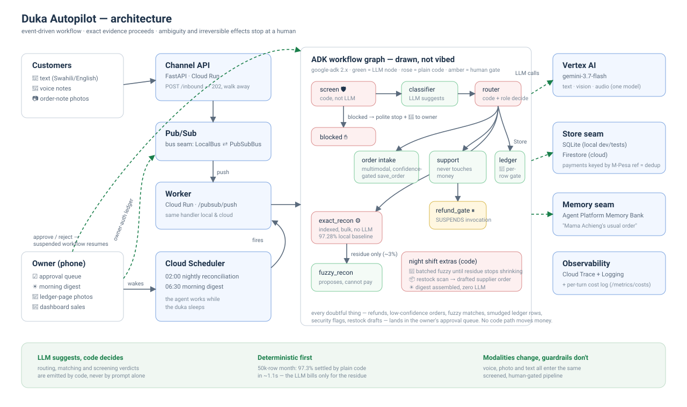

# Architecture

## The four seams

The system is organized around four swap-by-config seams, so the exact same
domain logic runs on a laptop with zero credentials and on Google Cloud:

| seam | local | cloud | switch |
|---|---|---|---|
| **Store** (`agents/store/`) | SQLite | Firestore | `DUKA_STORE` |
| **Bus** (`app/bus.py`) | in-process asyncio | Pub/Sub (push → `/pubsub/push`) | `DUKA_BUS` |
| **Sessions** (`app/runner.py`) | ADK in-memory Sessions | Agent Platform managed Sessions | `DUKA_ENV` + `AGENT_CONTEXT_ID` |
| **Memory** (`app/runner.py`) | keyword recall | Agent Platform Memory Bank | `DUKA_ENV` + `AGENT_CONTEXT_ID` |

Nothing above a seam knows which side is plugged in. That is why the whole
test suite is keyless and deterministic, and why "deploy" is configuration,
not a rewrite.

## The graph

One ADK workflow serves every modality. Rose nodes are plain code
(`FunctionNode`s), green nodes are LLM agents, amber is the human gate:

- **screen** (code) — injection phrasing, money-path social engineering and
  smuggled payloads are stopped before any LLM sees the message; flagged
  traffic files a `security_flag` for the owner and never routes.
- **classifier** (LLM) proposes a route; **router** (code) sanitizes and
  emits it. Owner-only ledger and reconciliation decisions are rejected unless
  trusted Session state carries `actor_role=owner`; customer input cannot set
  this value. The LLM cannot route anywhere the code doesn't allow.
- **order intake / support / ledger** (LLM) can only act through tools, and
  the tools hold the gates: `save_order` files low-confidence orders for
  review, `request_refund` can only open a request, and the owner-scoped
  `record_ledger_rows` tool gates per row.
- **exact_recon** (code) settles ~97% of a statement month in about a
  second in the recorded local synthetic baseline; **fuzzy_recon** (LLM) sees
  only the residue and can only file proposals. Cloud timing remains a release
  evidence gate.
- **refund_gate** (code) SUSPENDS the invocation graph-natively; the owner's
  decision resumes the same conversation.

## The night shift

Cloud Scheduler executes the private nightly Cloud Run Job at 02:00: exact
pass, then fuzzy batches through the same graph until the residue stops
shrinking, then a restock shelf scan, persisted report, and morning digest —
deterministically, because nobody wants an LLM between the books and the money
numbers.

## Where bookkeeping can change

Exact evidence may update bookkeeping automatically. Ambiguous or proposed
effects converge on authenticated `POST /approvals/{id}`: refunds,
low-confidence orders, fuzzy matches, doubtful ledger rows, restock drafts and
security flags. The application records refund/restock approvals for manual
fulfillment; it does not initiate an external payment or supplier order.
